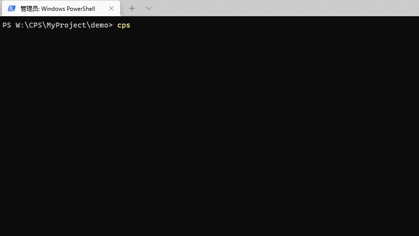

# cps-cli-template node-ts

这是一个基于编写node项目的基础框架，主要功能用：

- 单入口 `src/index.ts`
- 编译成cjs和mjs两个版，自动兼容新旧版node


# 项目结构

```

```


# Usage
```bash
# install the cli

npm i -g @mucpsing/cli
# or
yarn add @mucpsing/cli -g

# download template
cps template node-ts
```


## use with cli

通过cli安装，模版会自动更新`package.json`的 `name` 和 `author` 字段




## use with git clone

```bash
# git clone
git clone --depth=1 git@gitee.com:cps-cli-template/node-ts.git

# delete the .git floder
rm -r ./node-ts/.git
```
